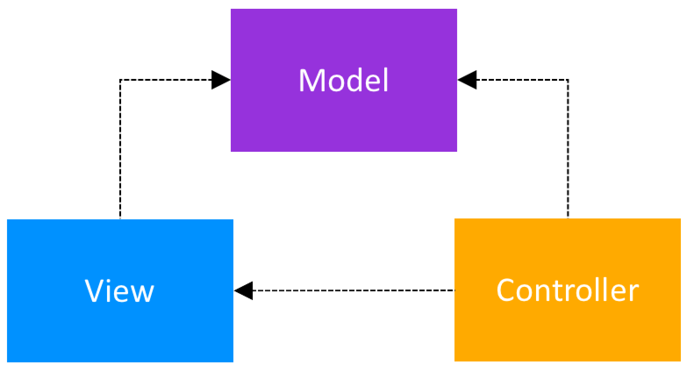

# C# Audio Player


## Model-View-Controller


## Depencies
    * FFMpeg
    * Spectre.Console

```sh
dotnet add package Spectre.Console
```
### commands that the wrapper runs
```sh
ffplay -nodisp -autoexit -loglevel quiet "<your_sound_file.wav>"
```